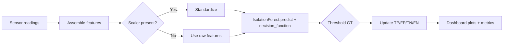

# Machine Learning Model: Detailed Project Explanation

This document explains the anomaly detection model used in the Industrial 5G Monitoring project. It covers the algorithm choice, alternatives, training pipeline, evaluation strategy, how predictions are made in real time, results interpretation, and future improvements.

Project code references:

- Dashboard: `scripts/streamlit_dashboard_integrated.py`
- 5G simulator: `scripts/realtime_5g_simulator_v2.py`
- Pre-trained model file: `models/5g_realtime_model.pkl`

The model monitors four live signals from a simulated 5G base station:

- `temperature_C` (°C)
- `power_consumption_W` (W)
- `signal_strength_dBm` (dBm)
- `network_load_percent` (%)

---

## Algorithm used

- Selected algorithm: Isolation Forest (unsupervised, tree-based anomaly detector)
- Library: scikit-learn (`sklearn.ensemble.IsolationForest`)
- Preprocessing: Standardization with `StandardScaler` (mean 0, unit variance)

### How Isolation Forest works

- Builds many random trees by repeatedly selecting a feature and a random split value.
- Points that are easier to isolate (shorter average path length across trees) are considered more anomalous.
- Outputs:
  - `predict(X)`: +1 for normal, -1 for anomaly.
  - `decision_function(X)`: higher is more normal; lower (more negative) is more anomalous.

### Why Isolation Forest

- Unsupervised: Works without labeled anomalies, which matches this streaming scenario.
- Efficient and scalable: Fast to train and predict even with higher frequency streams.
- Robust to non-Gaussian distributions and mixed feature scales (with standardization).
- Tunable anomaly rate via `contamination` (we use ~0.02 for the static model; the real-time learner adapts it).
- Simple persistence via `joblib` and reliable runtime behavior in Streamlit.

---

## Alternative algorithms considered

1. One-Class SVM (OC-SVM)

- Pros: Strong for compact normal class boundaries; kernelized decision surfaces.
- Cons: Sensitive to feature scaling; kernel selection/tuning is non-trivial; slower on larger datasets.
- Not chosen: Requires careful parameter tuning (nu, kernel, gamma) and can be brittle under distribution shift.

2. Local Outlier Factor (LOF)

- Pros: Density-based; good for local outliers in static batches.
- Cons: No native `predict` for new points (transductive); expensive for streaming; sensitive to k.
- Not chosen: Real-time scoring is clunky; poor fit for streaming/online scoring.

3. Autoencoder (feed-forward or LSTM)

- Pros: Learns non-linear manifolds; strong for complex temporal patterns.
- Cons: Needs substantial labeled/representative data; training/computation overhead; deployment complexity.
- Not chosen: Overkill for current 4-D feature space and synthetic data; higher maintenance cost.

4. Elliptic Envelope / Robust Covariance

- Pros: Simple, fast; assumes elliptical Gaussian.
- Cons: Assumption often violated; sensitive to non-Gaussian tails.
- Not chosen: Less robust than Isolation Forest for mixed distributions.

5. PCA-based anomaly detection

- Pros: Interpretable; low-rank structure leverage.
- Cons: Linear subspace assumption; reconstruction thresholds can be tricky.
- Not chosen: We want stronger non-linear separation and simpler tuning.

---

## Model training process

Two modes exist in the codebase:

- Static dashboard detector (this dashboard): loads `models/5g_realtime_model.pkl` (if present) or trains a fresh Isolation Forest on simulated normal data.
- Real-time learner (in the simulator v2): periodically retrains with adaptive contamination and persists to the same file.

### Dataset

- Source: 5G base station simulator (`FiveGBaseStation`).
- Signals (features): `temperature_C`, `power_consumption_W`, `signal_strength_dBm`, `network_load_percent`.
- Data type: Numerical, continuous.
- Size for initial fit (fallback): ~500 simulated points (mostly normal), drawn with realistic noise and daily patterns.

### Preprocessing

- Assemble features in the fixed order: `[temperature_C, power_consumption_W, signal_strength_dBm, network_load_percent]`.
- Standardize features with `StandardScaler` (fit on training data; store the scaler alongside the model).

### Model initialization (typical)

```python
IsolationForest(
  n_estimators=200,      # number of trees
  contamination=0.02,   # expected fraction of anomalies
  random_state=42
)
```

- In the real-time learner, `n_estimators` may be 100–150 and `contamination` adapts over time based on feedback.

### Training pipeline (static)

1. Generate training set from simulator (~500 samples; reduced anomaly probability).
2. Fit `StandardScaler` on X; transform to Xs.
3. Fit `IsolationForest` on Xs.
4. Persist with `joblib` as a dict: `{'model': model, 'scaler': scaler, ...}` to `models/5g_realtime_model.pkl`.

### Validation and tuning

- In the dashboard, ground truth is approximated with threshold-based rules per feature (with small tolerances). This enables online calculation of TP/FP/TN/FN without labeled data.
- Offline validation (recommended): holdout or rolling time-based split from recorded logs; tune `contamination`, `n_estimators`, and threshold buffers to balance precision/recall.
- Cross-validation: For streaming data, time-based splits (forward chaining) are preferred rather than random k-fold.

---

## Model evaluation

Online metrics computed in the dashboard (`StaticAnomalyDetector.get_metrics`):

- Accuracy, Precision, Recall, F1-score
- Confusion Matrix: [[TN, FP], [FN, TP]]
- Total predictions

Ground truth proxy: threshold-based ranges with tolerance buffers (e.g., temperature 35–65°C ±1°C, power 2400–4500W ±120W, signal -85 to -65 dBm ±2 dBm, load 25–90% ±3%).

- Pros: Simple, immediate, no labels required.
- Cons: Not perfect—some anomalies may not violate thresholds; some violations may be benign.

Observed (example run from logs):

- Accuracy ≈ 96% under typical simulator settings (real-time learner v46).
- FP and FN rates depend on thresholds, tolerance, and contamination; the dashboard shows these counters live.

> Note: For a real deployment, capture labeled events and perform a proper offline evaluation with precision/recall at various thresholds, ROC-like analysis based on `decision_function`, and cost-weighted metrics if needed.

---

## Prediction mechanism (runtime)

Step-by-step (dashboard detector):

1. Read latest sensor values from simulator.
2. Build feature vector `x = [temp, power, signal, load]` in fixed order.
3. If a scaler is available, transform: `x' = scaler.transform([x])`; otherwise use raw `x`.
4. Score with Isolation Forest:
   - `y = model.predict(x')` → anomaly if `y == -1`
   - `s = decision_function(x')` → lower is more anomalous (fallback score if not available)
5. Determine ground-truth proxy by comparing `x` to per-feature thresholds ± tolerance.
6. Update TP/FP/TN/FN counters and display metrics/plots.

Pseudo-code:

```python
x = [temp, power, signal, load]
X = scaler.transform([x]) if scaler else [x]
pred = model.predict(X)[0]           # -1 anomaly, +1 normal
try:
    score = model.decision_function(X)[0]
except Exception:
    score = -1.0 if pred == -1 else 1.0
predicted_is_anomaly = (pred == -1)
actual_is_anomaly = outside_thresholds(x, thresholds, tolerance)
update_metrics(predicted_is_anomaly, actual_is_anomaly)
```

Optional flow diagram (Mermaid):



---

## Results and interpretation

- Output signals:
  - Predicted anomaly flag per sample
  - Anomaly score (decision function)
  - Threshold violation list (which sensors breached limits)
- Visualization:
  - 4 subplots for the signals with anomaly markers
  - Anomaly score timeline
  - Confusion matrix and metric cards (accuracy, precision, recall, F1)

Interpretation in context:

- An anomaly flag indicates the current multi-sensor pattern deviates from the learned normal behavior.
- A threshold violation pinpoints which sensor(s) are outside expected ranges, aiding diagnosis (e.g., overheating or power surge).
- Use both together: ML detection for subtle patterns; thresholds for human-readable diagnostics.

---

## Future improvements

1. Better ground truth and evaluation

- Replace threshold GT with labeled incidents or expert review.
- Collect real logs; evaluate with time-aware CV; compute precision/recall per anomaly type.

2. Temporal modeling

- Add short-term features (rolling mean/std, deltas) or sequence models (LSTM/GRU) if needed.

3. Adaptive thresholds and feedback

- Learn thresholds from data distribution; incorporate operator feedback (confirm/deny anomalies) to update contamination and weights.

4. Drift detection and scheduled retraining

- Monitor feature drift; automate model refresh when drift is detected.

5. Calibration and scoring

- Calibrate the decision function to a probabilistic score for easier thresholding and alert policies.

6. Robustness and speed

- Quantize/approximate models for edge devices; batch-score multiple stations; parallelize where useful.

7. Explainability

- Use tree path lengths, feature-wise contributions, or surrogate models to explain individual anomaly decisions.

---

## Reproducibility and persistence

- Model is saved/loaded with `joblib` at `models/5g_realtime_model.pkl`.
- The loader supports three formats:
  1. Dict with `{'model': ..., 'scaler': ...}` (recommended)
  2. `sklearn.pipeline.Pipeline` with scaler + estimator
  3. Raw `IsolationForest` estimator (no scaler)
- The dashboard gracefully handles missing scaler by scoring on raw features.

If you retrain the model, overwrite the same file and refresh the dashboard (or press the Reset Metrics button). The app re-loads the model and uses it for new predictions.
